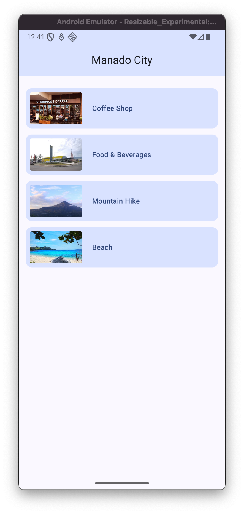
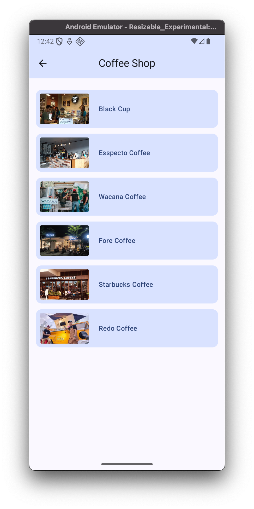
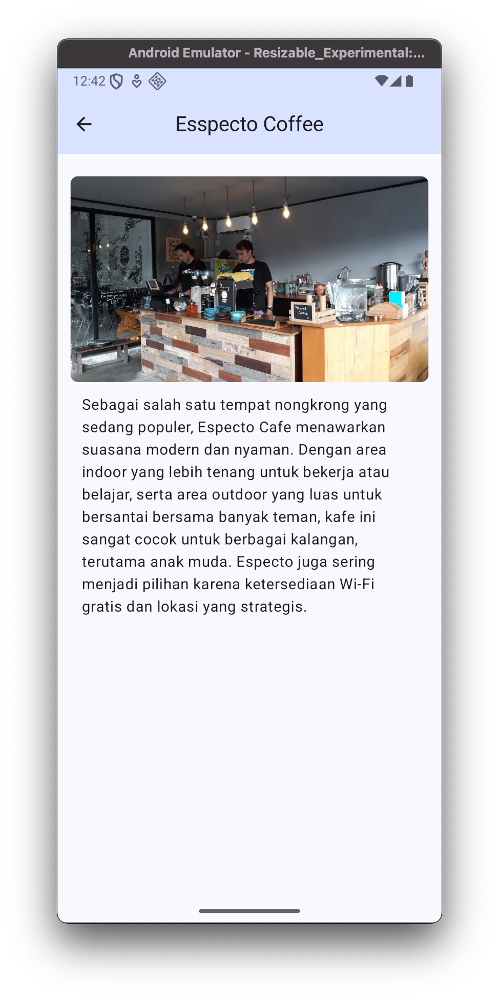
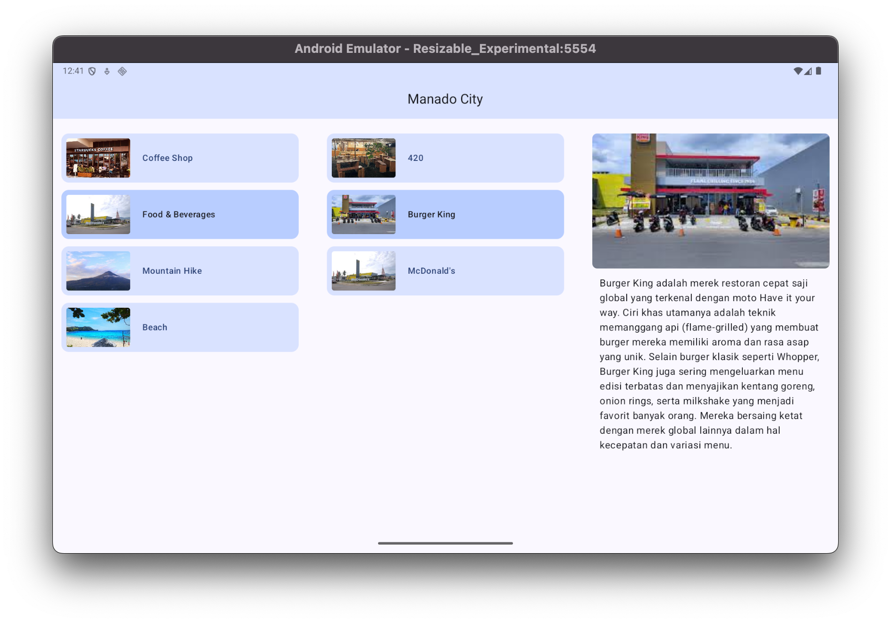

# My City App
MyCityApp is a practice project built with **Android Jetpack Compose**. The app displays categories of places in a city (such as cafés, restaurants, mountains, and beaches), shows recommended places based on the selected category, and provides details for each place.

<p float="left">
    
    
    
</p>

<p align="left">
    
</p>


## 🔧 Implemented Features 
- **Navigation Component** for screen transitions
- **ViewModel & UiState (UDF approach)** for state management
- **Adaptive Layouts** for phone and tablet support
- **Separation of Concerns** between data layer, ViewModel, and UI  

## 🚀 How to Run 
1. Clone the repository 
    ```bash
      git clone https://github.com/your-username/MyCityApp.git
    ```
2. Open the project in **Android Studio** (latest version)
3. Run the app on an emulator or a physical device

## 📖 Project Source
This project is based on the **Android Developers training course** for Jetpack Compose, adapted and expanded for learning purposes.